# Waste Management Route Optimization

<a href="#thai-version">TH</a> | <a href="#english-version">EN</a>

> **หมายเหตุสำคัญ**
>
> โครงการนี้เป็นโครงงานจบการศึกษาระดับปริญญาตรีของผู้จัดทำ โดยพัฒนาร่วมกันกับเพื่อนร่วมทีม
> ระบบฉบับใช้งานสำหรับการทดสอบเชิงปฏิบัติการจำเป็นต้องเข้าสู่ระบบ (Login) ก่อนใช้งาน แม้ข้อมูลภายในจะเป็นข้อมูลทดสอบ แต่มีการอ้างอิงตำแหน่งและบริบทจากจุดจริงในจังหวัดขอนแก่น เพื่อรองรับการทดสอบกรณีใช้งานเสมือนจริง (Real-World Cases)
> เพื่อป้องกันความเสี่ยงจากการแก้ไขหรือใช้งานข้อมูลในลักษณะที่ไม่เหมาะสมโดยผู้ทดสอบภายนอก Repository นี้จึงเปิดเผยเฉพาะส่วน Demo, System Architecture และข้อมูลเชิงภาพรวมที่จำเป็นต่อการนำเสนอผลงาน

## ภาพรวมของโปรเจค

เว็บแอปสำหรับวางแผนเส้นทางเก็บขยะที่ลดค่าใช้จ่ายมากที่สุดของเทศบาล โดยช่วยให้เจ้าหน้าที่จัดรอบวิ่งรถได้แม่นยำขึ้น และให้พนักงานขับรถเห็นเส้นทางที่ควรวิ่งจริงบนแผนที่

จุดเด่นคือการคำนวณเส้นทางจากข้อมูลหน้างาน เช่น ปริมาณขยะ ความจุรถ ระยะทาง และต้นทุนเชื้อเพลิง เพื่อให้หน่วยงานตัดสินใจได้เร็วขึ้นภายใต้ทรัพยากรที่จำกัด

## ปัญหาที่โปรเจคนี้ช่วยเเก้ไข

- ปริมาณขยะเพิ่มขึ้น แต่จำนวนรถ คน และงบประมาณไม่ได้เพิ่มตาม
- การวางแผนเส้นทางแบบเดิมใช้เวลามาก และทำให้เกิดเส้นทางอ้อม/ซ้ำ
- ต้นทุนเชื้อเพลิงและค่าบำรุงรักษารถสูงขึ้นจากการเดินรถที่ไม่เหมาะสม
- พื้นที่บางส่วนถูกเก็บไม่ทั่วถึง ส่งผลต่อสุขอนามัยและคุณภาพชีวิตของประชาชน

ผลลัพธ์ที่คาดหวังคือ ลดระยะทางและเวลาในการเก็บขยะ ลดต้นทุนการปฏิบัติงาน และเพิ่มความครอบคลุมของการให้บริการในชุมชน

## Demo

### 1) Login และ Register

**Login**

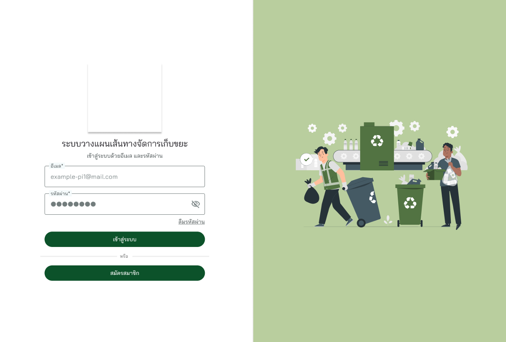

**Register**

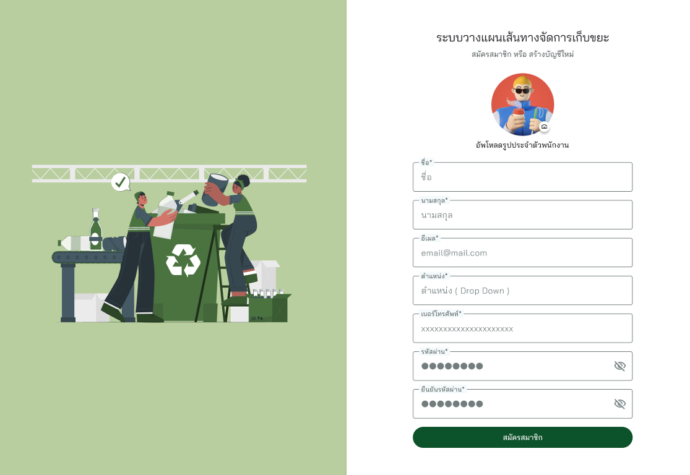

### 2) Home

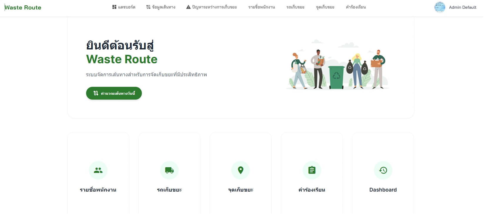

### 3) ดูข้อมูลพนักงาน

**รายชื่อพนักงานทั้งหมด**

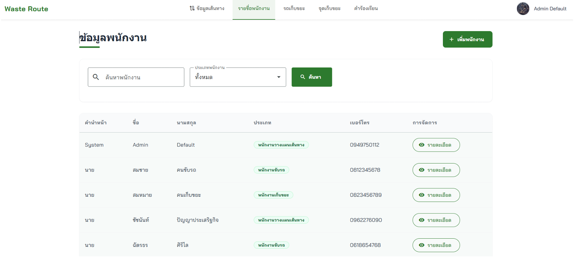

**รายละเอียดพนักงานรายบุคคล**

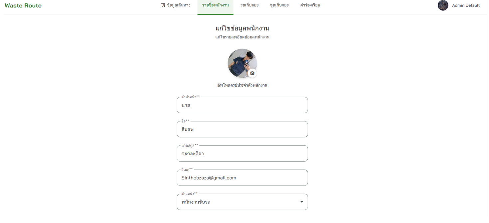

**แก้ไขข้อมูลพนักงานรายบุคคล**

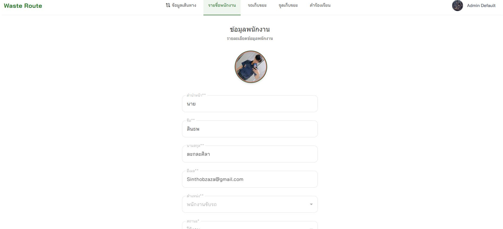

### 4) ดูข้อมูลรถเก็บขยะ

**รายชื่อรถเก็บขยะทั้งหมด**

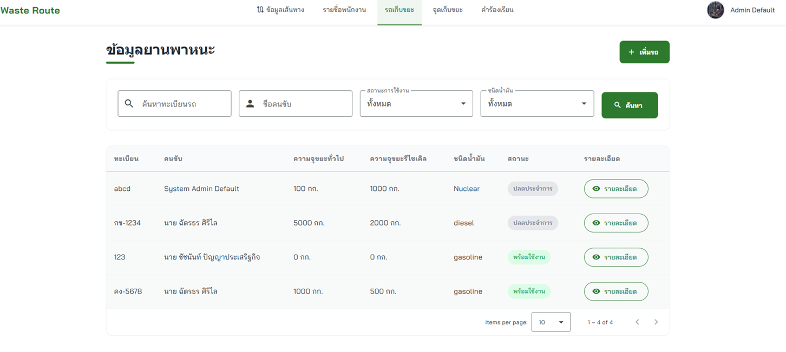

**รายละเอียดรถเก็บขยะรายคัน**

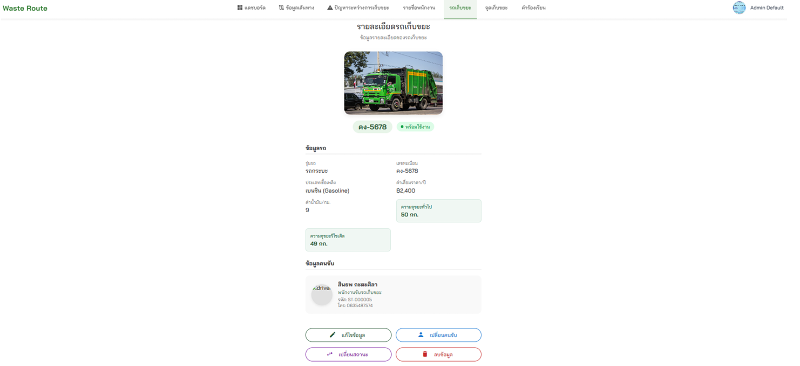

**กำหนดคนขับให้รถเก็บขยะ**

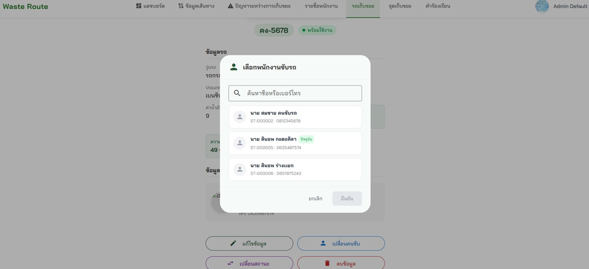

### 5) ดูข้อมูลจุดเก็บขยะ

**รายชื่อจุดเก็บขยะทั้งหมด**

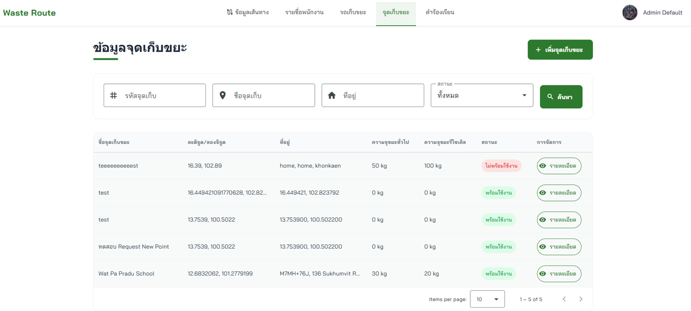

**รายละเอียดจุดเก็บขยะ**

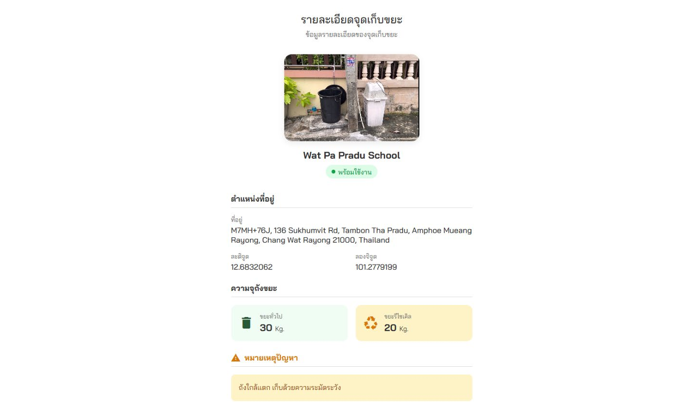

**เพิ่มหรือแก้ไขจุดเก็บขยะ**

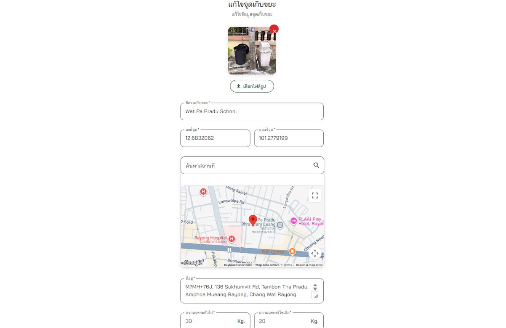

### 6) ข้อมูลเส้นทางประจำวัน

**เส้นทางรวมของรถทุกคันในวันนั้น**

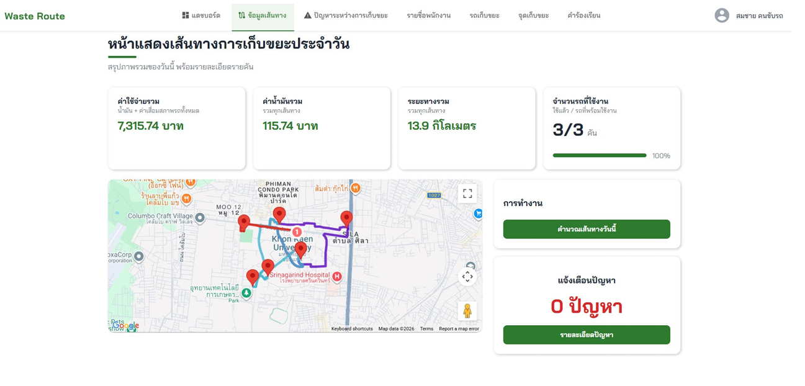

**เส้นทางประจำวันของรถเฉพาะ 1 คัน**

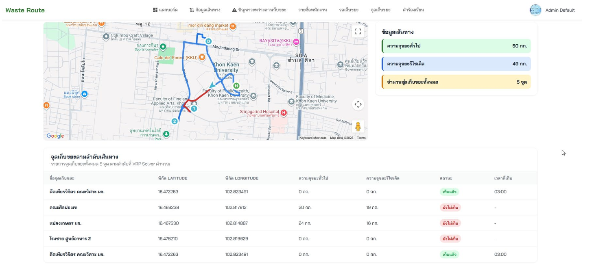

**ปัญหาระหว่างปฏิบัติงานที่พนักงานรายงานเข้ามา**

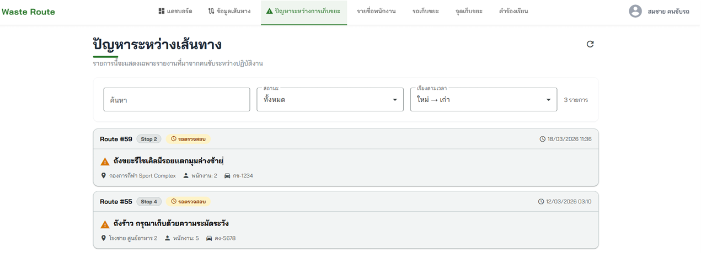

### 7) Dashboard ภาพรวมการปฏิบัติการ

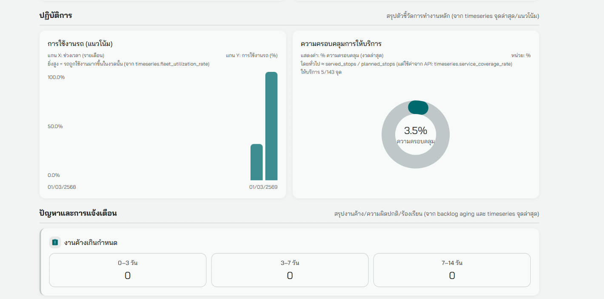

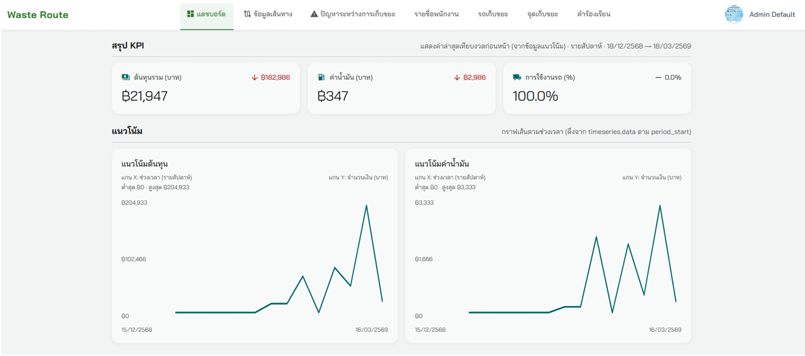

### 8) คำขอเพิ่มจุดเก็บขยะ/แจ้งปัญหาจากประชาชนทั่วไป

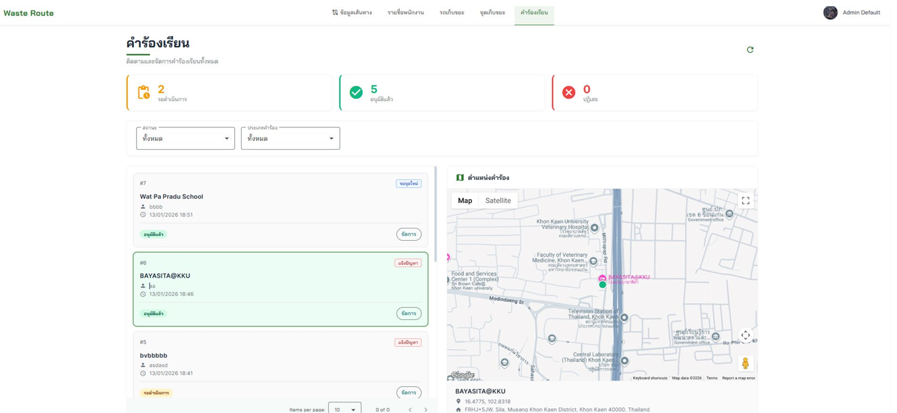

### 9) Video Demo realtime GPS

[▶ Watch Demo on YouTube](https://youtu.be/bVQGFt6eIVQ)

## Stack ที่เลือกใช้

- Go + Fiber: เหมาะกับงาน API ที่ต้องเร็วและรองรับงานพร้อมกันจำนวนมาก ทำให้ระบบตอบสนองได้ดีในงานภาคสนาม
- GORM + PostgreSQL/MySQL: จัดการข้อมูลเส้นทางและจุดเก็บได้เป็นระบบ ปลอดภัย และดูแลต่อยอดง่าย
- Angular + Angular Material: สร้างหน้าใช้งานแบบมืออาชีพและอ่านข้อมูลได้ชัดเจน ช่วยให้เจ้าหน้าที่ใช้งานจริงได้เร็ว
- Google Maps API: ทำให้การมองเห็นเส้นทางและจุดเก็บเป็นภาพเดียวกัน ลดความคลาดเคลื่อนในการปฏิบัติงาน
- Docker + Docker Compose + Nginx: ทำให้ deploy ซ้ำได้เสถียรในทุก environment และจัดการระบบหลายบริการได้ง่าย

---

## System Architecture

สถาปัตยกรรม production ปัจจุบันแยกเป็น 3 containers เพื่อแยกความรับผิดชอบชัดเจน: Front-end, Back-end และ VRP Solver

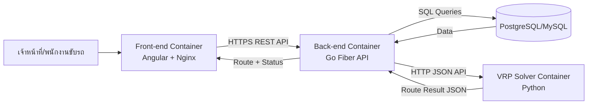

การไหลของข้อมูลแบบย่อสำหรับ Feature การคำนวณเส้นทางรถเก็บขยะ:

- Front-end ส่งคำขอคำนวณเส้นทางไป Back-end
- Back-end เตรียมข้อมูลจุดเก็บ/รถ/ข้อจำกัด แล้วเรียก VRP Solver
- VRP Solver คืนผลเส้นทางที่เหมาะสมกลับมาให้ Back-end
- Back-end บันทึกผลลงฐานข้อมูล และส่งผลกลับไปแสดงบนแผนที่ที่ Front-end

หมายเหตุด้านคิวงาน:

- เวอร์ชันปัจจุบันใช้การเรียก API แบบ synchronous ระหว่าง Back-end กับ VRP Solver
- สามารถต่อยอดเป็น job queue ได้เมื่อปริมาณงานสูงหรือมีหลายแผนวิ่งพร้อมกัน

## Key Technical Challenges

- ปัญหา: งานคำนวณเส้นทางมีความซับซ้อนสูงเมื่อจำนวนจุดเก็บเพิ่มขึ้น
  วิธีแก้: แยก Python VRP Solver เป็นคนละ container และเรียกผ่าน API เพื่อ scale งานคำนวณแยกจาก business API
  ผลลัพธ์: ระบบหลักยังตอบสนองได้ดี และปรับกำลังประมวลผลฝั่ง solver ได้ยืดหยุ่น

- ปัญหา: ข้อจำกัดจริงมีหลายมิติ (ความจุรถ, หลายประเภทขยะ, ต้นทุนเชื้อเพลิง, ค่าสึกหรอ)
  วิธีแก้: ออกแบบ input model กลางให้ Back-end ส่งข้อมูลข้อจำกัดแบบโครงสร้างเดียวไปยัง solver
  ผลลัพธ์: ตรรกะคำนวณชัดเจนขึ้น ดูแลรักษาง่าย และเพิ่ม constraint ใหม่ได้เร็ว

- ปัญหา: การเชื่อมระบบข้ามภาษา (Go และ Python) เสี่ยงเรื่อง format/contract ไม่ตรงกัน
  วิธีแก้: กำหนดสัญญา API แบบ JSON ชัดเจน (request/response schema) และแยกหน้าที่แต่ละ service ให้ชัด
  ผลลัพธ์: ลด bug จาก integration และ deploy แต่ละ service แยกกันได้ปลอดภัยขึ้น

## Theory Behind The Code (VRP แบบเข้าใจง่าย)

ระบบนี้ใช้แนวคิด Vehicle Routing Problem (VRP) เพื่อหาว่า "รถคันไหนควรไปจุดไหน และไปลำดับใด" ให้คุ้มที่สุดภายใต้ข้อจำกัดจริงของงานเก็บขยะ

ภาพง่าย ๆ คือ:

- มีจุดเริ่มต้นเดียว (depot) เเละรถต้องกลับมายังจุดเริ่มต้นเป็นจุดสุดท้าย
- มีหลายจุดเก็บขยะ (collection points)
- จุดเก็บขยะเเต่ละจุดมีความจุุจำกัด
  (เเยกประเภทเป็นความจุขยะทั่วไป เเละขยะรีไซเคิล)
- รถแต่ละคันมีความจุจำกัด (เเยกประเภทเป็นความจุขยะทั่วไป เเละขยะรีไซเคิล)
- เป้าหมายคือ ลดต้นทุนรวม (ระยะทาง + เวลา + ค่าเชื้อเพลิง + ค่าสึกหรอรถ)

### Objective (อธิบายแบบสั้น)

ระบบพยายามทำให้ค่าต่อไปนี้ต่ำที่สุด:

$$
\min Z = \sum_{v=1}^{V} \sum_{i=0}^{n} \sum_{j=0}^{n} d_{ij} \cdot x_{ijv}
$$

โดยสรุปความหมาย:

- $d_{ij}$ = ระยะทางจากจุด $i$ ไปจุด $j$
- $x_{ijv}$ = 1 เมื่อรถคัน $v$ วิ่งจาก $i$ ไป $j$, ถ้าไม่ใช่เป็น 0
- $V$ = จำนวนรถทั้งหมด, $n$ = จำนวนจุดเก็บขยะ

### Constraints หลักที่ใช้จริง

- ความจุรถ: ปริมาณขยะรวมบนเส้นทางของรถแต่ละคันต้องไม่เกินความจุ (เเยกเป็นส่วนความจุขยะรีไซเคิลเเละขยะทั่วไป)
- ความครบถ้วนของบริการ: ทุกจุดเก็บต้องถูกให้บริการตามเงื่อนไขที่กำหนด (ความจุรถรวมทั้งหมดต้องมากกว่าความจุรวมทั้งหมดของจุดเก็บขยะในเส้นทาง เพื่อมั่นใจว่าสามารถเก็บขยะครบทุกจุด)

สำหรับโปรเจกต์นี้ แนวคิดถูกปรับใช้ในรูปแบบที่รองรับการเก็บหลายประเภทขยะ และสามารถนำไปต่อยอดเป็น dynamic rerouting ในอนาคต (เช่นใช้คู่กันกับ IoT ในอนาคตเพื่ออัพเดทข้อมูลเส้นทางที่เเม่นยำเเละ Real Time มากขึ้น)

### Credit Placeholders

- เพื่อนร่วมทีมโปรเจค Fullstack and setup architecure
  - [ศักจานนท์ กมลดุง]
  - [https://github.com/sakjanonkk]

- สมการ/แนวคิดหลักที่อ้างอิง:
  - [ธนาตญ์ ปัทมากรโกมล]
  - [เค้าโครงวิทยานิพนธ์ วิศวกรรมศาสตรมหาบัณฑิต, มหาวิทยาลัยขอนแก่น]

- เครดิตผู้พัฒนาโค้ด Python ส่วน VRP (Solver Container):
  - [นาย ฉัตรปกรณ์ คงศรีสรรค์]

## How The Code Is Connected (2 Containers + API)

เพื่อให้ระบบยืดหยุ่นและดูแลแยกทีมได้ง่าย โครงสร้างนี้แยกเป็น 2 บริการหลัก:

1. Core API Container (Go)

- รับคำขอจากหน้าเว็บ
- จัดการข้อมูลจุดเก็บ/รถ/ข้อจำกัด
- เรียกใช้งาน VRP Solver ผ่าน HTTP API
- บันทึกผลลัพธ์และส่งเส้นทางกลับไปแสดงผลบนแผนที่

2. VRP Solver Container (Python)

- รับ input ปัญหา VRP ในรูปแบบ JSON
- คำนวณเส้นทางที่เหมาะสมตาม objective และ constraints
- ส่งผลลัพธ์กลับให้ Go API เพื่อนำไปใช้งานต่อ

ข้อดีของการแยกแบบนี้:

- เปลี่ยนหรืออัปเกรด solver ได้โดยไม่กระทบ API หลัก
- scale งานคำนวณหนักแยกจากงาน business API ได้
- ชัดเจนเรื่อง ownership และเครดิตของโค้ดแต่ละส่วน

---

# Waste Management Route Optimization (English Version)

> **Important Note**
>
> This project is the author's undergraduate graduate project, developed collaboratively with teammates.
> The operational test version requires user login before access. Although the data used is test data, it is based on real locations and real-world context in Khon Kaen province to support realistic testing scenarios (Real-World Cases).
> To prevent risks from improper data modification or misuse by external testers, this repository publicly provides only demo materials, system architecture, and general project information required for portfolio presentation.

## Project Overview

This web application is designed for municipal waste collection route planning with the objective of minimizing operational costs. It helps officers create more accurate daily routes and allows drivers to follow practical routes directly on the map.

Its key strength is route optimization based on field data such as waste volume, vehicle capacity, distance, and fuel cost, enabling faster and more informed decisions under limited resources.

## Problems This Project Solves

- Waste volume keeps increasing, while fleet size, manpower, and budget do not scale at the same rate.
- Traditional manual planning is time-consuming and often causes overlapping or inefficient routes.
- Fuel and maintenance costs rise due to non-optimized routing.
- Some service areas are not covered consistently, affecting sanitation and public health.

Expected outcomes are reduced collection distance and time, lower operating costs, and improved service coverage in communities.

## Demo

### 1) Login and Register

**Login**

**Register**

### 2) Home

### 3) Staff Information

**All Staff List**

**Individual Staff Details**

**Edit Individual Staff Details**

### 4) Waste Collection Vehicle Information

**All Waste Collection Vehicles**

**Individual Vehicle Details**

**Assign Driver to Vehicle**

### 5) Collection Point Information

**All Collection Points**

**Collection Point Details**

**Add or Edit Collection Point**

### 6) Daily Route Information

**All Vehicle Routes for the Day**

**Daily Route for One Specific Vehicle**

**Operational Problems Reported by Staff During Collection**

### 7) Operations Dashboard Overview

### 8) Public Requests for New Collection Points / Issue Reports

### 9) Real-Time GPS Video Demo

[▶ Watch Demo on YouTube](https://youtu.be/bVQGFt6eIVQ)

## Selected Tech Stack

- Go + Fiber: Suitable for high-performance APIs and strong concurrency support, which helps ensure good responsiveness in field operations.
- GORM + PostgreSQL/MySQL: Provides structured, secure, and maintainable management of routes and collection point data.
- Angular + Angular Material: Enables a professional, readable, and practical UI so officers can use the system effectively.
- Google Maps API: Makes routes and collection points visible in one map context, reducing operational ambiguity.
- Docker + Docker Compose + Nginx: Provides stable and repeatable deployment across environments and simplifies multi-service management.

---

## System Architecture

The current production architecture is separated into 3 containers for clear responsibility boundaries: Front-end, Back-end, and VRP Solver.

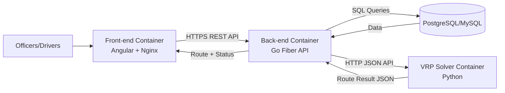

Simplified data flow for the waste collection route optimization feature:

- Front-end sends route calculation requests to Back-end.
- Back-end prepares collection points, vehicles, and constraints, then calls the VRP Solver.
- VRP Solver returns optimized routes to Back-end.
- Back-end stores results in the database and returns route data for map visualization on Front-end.

Queueing note:

- The current version uses synchronous API calls between Back-end and VRP Solver.
- It can be extended to a job queue model for higher workloads or multiple concurrent route plans.

## Key Technical Challenges

- Challenge: Route computation complexity grows significantly as the number of collection points increases.
  Solution: The Python VRP Solver is deployed as a separate container and integrated via API, allowing compute scaling independently from the business API.
  Result: Core system responsiveness remains stable, and solver compute capacity can be scaled flexibly.

- Challenge: Real constraints are multi-dimensional (vehicle capacity, multiple waste types, fuel cost, and vehicle wear/depreciation).
  Solution: A unified input model was designed so Back-end can send all constraints in a consistent structure to the solver.
  Result: Calculation logic is clearer, easier to maintain, and faster to extend with new constraints.

- Challenge: Cross-language integration (Go and Python) creates risks of contract and format mismatch.
  Solution: A clear JSON API contract (request/response schema) was defined, with explicit service boundaries.
  Result: Integration bugs are reduced, and each service can be deployed independently with lower risk.

## Theory Behind The Code (VRP in Simple Terms)

This project applies the Vehicle Routing Problem (VRP) concept to determine which vehicle should visit which points and in what sequence, under practical waste collection constraints.

In simple terms:

- There is one depot, and vehicles return to the depot at the end.
- There are multiple collection points.
- Each collection point has limited demand/capacity values by waste type (general and recyclable).
- Each vehicle has limited capacity by waste type (general and recyclable).
- The objective is to minimize total cost (distance + time + fuel + vehicle wear/depreciation).

### Objective (Short Explanation)

The system minimizes the following objective:

$$
\min Z = \sum_{v=1}^{V} \sum_{i=0}^{n} \sum_{j=0}^{n} d_{ij} \cdot x_{ijv}
$$

Where:

- $d_{ij}$ = distance from point $i$ to point $j$
- $x_{ijv}$ = 1 if vehicle $v$ travels from $i$ to $j$, otherwise 0
- $V$ = total number of vehicles, $n$ = total number of collection points

### Main Constraints Used

- Vehicle capacity: Total collected waste on each route must not exceed vehicle capacity (separated into recyclable and general waste capacity).
- Service completeness: Every required collection point must be served under defined constraints (total vehicle capacity must exceed total demand along the route to ensure full service coverage).

For this project, the approach is adapted for multi-type waste collection and can be extended to dynamic rerouting in the future (for example, with IoT data for more accurate and real-time updates).

### Credit Placeholders

- Teammate (Fullstack and architecture setup)
  - [ศักจานนท์ กมลดุง]
  - [https://github.com/sakjanonkk]

- Referenced equation/core theory:
  - [ธนาตญ์ ปัทมากรโกมล]
  - [Thesis Proposal, Master of Engineering, Khon Kaen University]

- Credit for Python VRP code (Solver Container):
  - [นาย ฉัตรปกรณ์ คงศรีสรรค์]

## How The Code Is Connected (2 Containers + API)

To improve flexibility and team maintainability, the architecture is separated into 2 core services:

1. Core API Container (Go)

- Receives requests from the web interface
- Manages collection points, vehicles, and operational constraints
- Calls the VRP Solver via HTTP API
- Stores results and returns routes for map visualization

2. VRP Solver Container (Python)

- Receives VRP problem input in JSON format
- Computes optimized routes based on objective and constraints
- Returns route results to the Go API for downstream use

Benefits of this separation:

- Solver can be upgraded or replaced without breaking the main API.
- Heavy compute workload can scale independently from business API workload.
- Ownership and contribution boundaries are clear across services.
