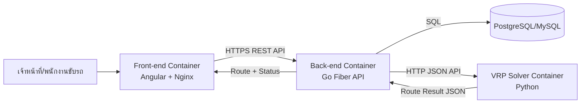

# Waste Management Route Optimization

> **หมายเหตุสำคัญ**
>
> โครงการนี้เป็นโครงงานจบการศึกษาระดับปริญญาตรีของผู้จัดทำ โดยพัฒนาร่วมกับเพื่อนในทีม
> ระบบฉบับใช้งานสำหรับการทดสอบเชิงปฏิบัติการจำเป็นต้องเข้าสู่ระบบ (Login) ก่อนใช้งาน แม้ข้อมูลภายในจะเป็นข้อมูลทดสอบ แต่มีการอ้างอิงตำแหน่งและบริบทจากจุดจริงในจังหวัดขอนแก่น เพื่อรองรับการทดสอบกรณีใช้งานเสมือนจริง (Real-World Cases)
> เพื่อป้องกันความเสี่ยงจากการแก้ไขหรือใช้งานข้อมูลในลักษณะที่ไม่เหมาะสมโดยผู้ทดสอบภายนอก Repository นี้จึงเปิดเผยเฉพาะส่วน Demo, System Architecture และข้อมูลเชิงภาพรวมที่จำเป็นต่อการนำเสนอผลงาน

## Project Overview

เว็บแอปสำหรับวางแผนเส้นทางเก็บขยะที่ลดค่าใช้จ่ายมากที่สุดของเทศบาล โดยช่วยให้เจ้าหน้าที่จัดรอบวิ่งรถได้แม่นยำขึ้น และให้พนักงานขับรถเห็นเส้นทางที่ควรวิ่งจริงบนแผนที่

จุดเด่นคือการคำนวณเส้นทางจากข้อมูลหน้างาน เช่น ปริมาณขยะ ความจุรถ ระยะทาง และต้นทุนเชื้อเพลิง เพื่อให้หน่วยงานตัดสินใจได้เร็วขึ้นภายใต้ทรัพยากรที่จำกัด

## Problem This Project Solves

- ปริมาณขยะเพิ่มขึ้น แต่จำนวนรถ คน และงบประมาณไม่ได้เพิ่มตาม
- การวางแผนเส้นทางแบบเดิมใช้เวลามาก และทำให้เกิดเส้นทางอ้อม/ซ้ำ
- ต้นทุนเชื้อเพลิงและค่าบำรุงรักษารถสูงขึ้นจากการเดินรถที่ไม่เหมาะสม
- พื้นที่บางส่วนถูกเก็บไม่ทั่วถึง ส่งผลต่อสุขอนามัยและคุณภาพชีวิตของประชาชน

ผลลัพธ์ที่คาดหวังคือ ลดระยะทางและเวลาในการเก็บขยะ ลดต้นทุนการปฏิบัติงาน และเพิ่มความครอบคลุมของการให้บริการในชุมชน

## Why This Stack

- Go + Fiber: เหมาะกับงาน API ที่ต้องเร็วและรองรับงานพร้อมกันจำนวนมาก ทำให้ระบบตอบสนองได้ดีในงานภาคสนาม
- GORM + PostgreSQL/MySQL: จัดการข้อมูลเส้นทางและจุดเก็บได้เป็นระบบ ปลอดภัย และดูแลต่อยอดง่าย
- Angular + Angular Material: สร้างหน้าใช้งานแบบมืออาชีพและอ่านข้อมูลได้ชัดเจน ช่วยให้เจ้าหน้าที่ใช้งานจริงได้เร็ว
- Google Maps API: ทำให้การมองเห็นเส้นทางและจุดเก็บเป็นภาพเดียวกัน ลดความคลาดเคลื่อนในการปฏิบัติงาน
- Docker + Docker Compose + Nginx: ทำให้ deploy ซ้ำได้เสถียรในทุก environment และจัดการระบบหลายบริการได้ง่าย

---

## System Architecture

สถาปัตยกรรม production ปัจจุบันแยกเป็น 3 containers เพื่อแยกความรับผิดชอบชัดเจน: Front-end, Back-end และ VRP Solver

การไหลของข้อมูลแบบย่อ:

- Front-end ส่งคำขอคำนวณเส้นทางไป Back-end
- Back-end เตรียมข้อมูลจุดเก็บ/รถ/ข้อจำกัด แล้วเรียก VRP Solver
- VRP Solver คืนผลเส้นทางที่เหมาะสมกลับมาให้ Back-end
- Back-end บันทึกผลลงฐานข้อมูล และส่งผลกลับไปแสดงบนแผนที่ที่ Front-end

หมายเหตุด้านคิวงาน:

- เวอร์ชันปัจจุบันใช้การเรียก API แบบ synchronous ระหว่าง Back-end กับ VRP Solver
- สามารถต่อยอดเป็น job queue ได้เมื่อปริมาณงานสูงหรือมีหลายแผนวิ่งพร้อมกัน

## Key Technical Challenges (ช่วงโชว์ของ)

- ปัญหา: งานคำนวณเส้นทางมีความซับซ้อนสูงเมื่อจำนวนจุดเก็บเพิ่มขึ้น
  วิธีแก้: แยก Python VRP Solver เป็นคนละ container และเรียกผ่าน API เพื่อ scale งานคำนวณแยกจาก business API
  ผลลัพธ์: ระบบหลักยังตอบสนองได้ดี และปรับกำลังประมวลผลฝั่ง solver ได้ยืดหยุ่น

- ปัญหา: ข้อจำกัดจริงมีหลายมิติ (ความจุรถ, หลายประเภทขยะ, ต้นทุนเชื้อเพลิง, ค่าสึกหรอ)
  วิธีแก้: ออกแบบ input model กลางให้ Back-end ส่งข้อมูลข้อจำกัดแบบโครงสร้างเดียวไปยัง solver
  ผลลัพธ์: ตรรกะคำนวณชัดเจนขึ้น ดูแลรักษาง่าย และเพิ่ม constraint ใหม่ได้เร็ว

- ปัญหา: การเชื่อมระบบข้ามภาษา (Go และ Python) เสี่ยงเรื่อง format/contract ไม่ตรงกัน
  วิธีแก้: กำหนดสัญญา API แบบ JSON ชัดเจน (request/response schema) และแยกหน้าที่แต่ละ service
  ผลลัพธ์: ลด bug จาก integration และ deploy แต่ละ service แยกกันได้ปลอดภัยขึ้น

## Theory Behind The Code (VRP แบบเข้าใจง่าย)

ระบบนี้ใช้แนวคิด Vehicle Routing Problem (VRP) เพื่อหาว่า "รถคันไหนควรไปจุดไหน และไปลำดับใด" ให้คุ้มที่สุดภายใต้ข้อจำกัดจริงของงานเก็บขยะ

ภาพง่าย ๆ คือ:

- มีจุดเริ่มต้นเดียว (depot)
- มีหลายจุดเก็บขยะ (collection points)
- รถแต่ละคันมีความจุจำกัด และมีเวลาปฏิบัติงานจำกัด
- เป้าหมายคือ ลดต้นทุนรวม (ระยะทาง + เวลา + ค่าเชื้อเพลิง + ค่าสึกหรอรถ)

### Objective (อธิบายแบบสั้น)

ระบบพยายามทำให้ค่าต่อไปนี้ต่ำที่สุด:

$$
\min Z = \sum_{v=1}^{V} \sum_{i=0}^{n} \sum_{j=0}^{n} d_{ij} \cdot x_{ijv}
$$

โดยสรุปความหมาย:

- $d_{ij}$ = ระยะทางจากจุด $i$ ไปจุด $j$
- $x_{ijv}$ = 1 เมื่อรถคัน $v$ วิ่งจาก $i$ ไป $j$, ถ้าไม่ใช่เป็น 0
- $V$ = จำนวนรถทั้งหมด, $n$ = จำนวนจุดเก็บขยะ

### Constraints หลักที่ใช้จริง

- ความจุรถ: ปริมาณขยะรวมบนเส้นทางของรถแต่ละคันต้องไม่เกินความจุ
- ความครบถ้วนของบริการ: ทุกจุดเก็บต้องถูกให้บริการตามเงื่อนไขที่กำหนด
- เงื่อนไขปฏิบัติงาน: คุมเวลา/รอบวิ่ง/ข้อจำกัดหน้างานตาม policy ของหน่วยงาน

สำหรับโปรเจกต์นี้ แนวคิดถูกปรับใช้ในรูปแบบที่รองรับการเก็บหลายประเภทขยะ และสามารถนำไปต่อยอดเป็น dynamic rerouting เมื่อมีเหตุการณ์หน้างาน

### Credit Placeholders

- สมการ/แนวคิดหลักที่อ้างอิง:
  - [ใส่ชื่อผู้วิจัย/หนังสือ/ปี]
  - [ใส่ DOI หรือ URL แหล่งอ้างอิง]
- เครดิตผู้พัฒนาโค้ด Python ส่วน VRP (Solver Container):
  - [ใส่ชื่อเจ้าของโค้ด]
  - [ใส่ Repo/Commit/License]
  - [ใส่ขอบเขตที่นำมาใช้: เช่น solver, data prep, tuning]

## How The Code Is Connected (2 Containers + API)

เพื่อให้ระบบยืดหยุ่นและดูแลแยกทีมได้ง่าย โครงสร้างนี้แยกเป็น 2 บริการหลัก:

1. Core API Container (Go)

- รับคำขอจากหน้าเว็บ
- จัดการข้อมูลจุดเก็บ/รถ/ข้อจำกัด
- เรียกใช้งาน VRP Solver ผ่าน HTTP API
- บันทึกผลลัพธ์และส่งเส้นทางกลับไปแสดงผลบนแผนที่

2. VRP Solver Container (Python)

- รับ input ปัญหา VRP ในรูปแบบ JSON
- คำนวณเส้นทางที่เหมาะสมตาม objective และ constraints
- ส่งผลลัพธ์กลับให้ Go API เพื่อนำไปใช้งานต่อ

ข้อดีของการแยกแบบนี้:

- เปลี่ยนหรืออัปเกรด solver ได้โดยไม่กระทบ API หลัก
- scale งานคำนวณหนักแยกจากงาน business API ได้
- ชัดเจนเรื่อง ownership และเครดิตของโค้ดแต่ละส่วน

---

หากต้องการเวอร์ชันเต็มสำหรับเอกสารโครงการ (หลักการและเหตุผล, วัตถุประสงค์, เครื่องมือทั้งหมด) สามารถต่อจากส่วนนี้ได้ทันที
